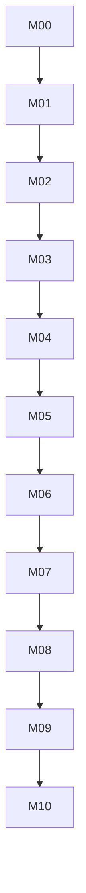

# Complete Plain-PHP Migration and Product Implementation Plan

## 1. Executive Summary

Incrementally port the verified Notes application from Laravel to application-owned PHP infrastructure, pass parity, remove Laravel, then add the planning domain. Keep the frontend stack and MySQL. The target is one deployable modular monolith.

## 2. Repository Audit

The audit is in [00-repository-audit.md](plan/00-repository-audit.md). It covers application code, routes, schema, dependencies, tests, frontend coupling, current features, and the dirty working tree.

## 3. Current Tech Stack

PHP 8.5, Laravel 13, MySQL 8.4, PHPUnit 12, Alpine.js, Vite 8, Node 22/npm 10, custom CSS, Blade, Composer. Retention/removal decisions are recorded in the audit and architecture contract.

## 4. Current Architecture

Same-origin server-rendered Notes app with JSON APIs, database sessions, Eloquent actions/queries, private file controllers, and frontend-owned Blade/JS/CSS.

## 5. Current Request/Data Flow

Browser → Laravel front controller/middleware → controller → action/query → Eloquent/MySQL → Resource/Blade. Autosave sends frozen full snapshots and reconciles acknowledgements. Files are written privately, then metadata is committed under an owner lock.

## 6. Existing Feature Inventory

Accounts, Notes, Labels, files, settings, and autosave are implemented. Browser/security evidence is incomplete in some cases. Every planning entity and AI action is new.

## 7. Laravel Dependency Inventory

Bootstrap, routing, middleware, Auth, sessions, CSRF, throttling, validation, Eloquent, resources, Blade, Vite integration, storage, errors/logging, Artisan, migrations, and test helpers require explicit replacements. No unused Laravel subsystem receives a speculative replacement.

## 8. What Can Remain Unchanged

CSS, most HTML/JavaScript, autosave/recovery, API paths/shapes, Notes rules, MySQL, storage layout, file constraints, and behavior-oriented tests.

## 9. What Must Change

HTTP lifecycle, routing, sessions/auth, validation, persistence, dependency wiring, migrations, errors, templates, asset integration, file responses, CLI, backend tests, dependencies, and active documentation.

## 10. Target Plain-PHP Architecture

An explicit layer-first modular monolith under `backend/src`: Config and Support; Domain and Application modules; Infrastructure adapters for PDO/session/storage/logging/AI; Http controllers/routing/security/validation/views; and Console commands. Parallel roots such as `src/Notes` are forbidden. See [02-architecture.md](plan/02-architecture.md).

## 11. Target Domain Model

Area, Goal, Milestone, Task, ChecklistItem, Habit, HabitCheckIn, Note, Tag, Review, Activity, AIAction, and TaskSeries. Purpose, fields, lifecycles, and relationships are frozen in [10-domain-contract.md](plan/10-domain-contract.md).

## 12. Domain Invariants and Business Rules

Single-owner access, single primary location, three distinct relation systems, acyclic hierarchy/dependencies, independent Task concepts, explicit completion, archive constraints, and AI/manual parity.

## 13. Proposed Database Model

Retain compatible existing tables in a fresh target schema and add normalized owned tables, typed junctions, recurrence/history/AI infrastructure, checks, composite owner foreign keys, and query-driven indexes. See [03-database.md](plan/03-database.md).

## 14. Hierarchy Design

Adjacency lists. Root Goals reference Area; nested Goals reference parent Goal. Iterative cycle checks run inside an owner-serialized transaction. Area is derived by root traversal rather than duplicated.

## 15. Contribution Relationship Design

Typed source-to-Goal junctions. Contributions never move objects or affect progress. Goal-to-Goal contribution edges are acyclic and owner-scoped.

## 16. Milestone Dependency Design

Typed prerequisite DAG. Incomplete prerequisites block Milestone completion. Tasks remain available. Completed-state changes cannot make an already completed dependent invalid.

## 17. Goal Progress Design

Equal mean of active immediate finite components. Descendant progress propagates bottom-up. Tasks inside Milestones are not double-counted. Criteria remain informational. Calculate live values; store only historical daily snapshots.

## 18. Task / Checklist / Completion Criteria Design

Task status, Checklist state, and textual completion criteria are independent. A Task may link one existing Note. Daily/weekly occurrences are ordinary independent Tasks and excluded from Goal progress.

## 19. Habit Design

Dedicated daily/weekly definitions with date check-ins, target frequency, Goal relationships, importance, Tags, and history. Streak calculation is deferred.

## 20. Tag Design

Extend existing Labels with parent and color. Keep `/labels` compatibility; add `/tags`. Tag hierarchy is separate from Goal hierarchy.

## 21. Review Design

Persist Daily/Weekly/Monthly drafts, generated summary snapshots, reflection fields, finalization, and explicit reopen. Finalized snapshots never silently change.

## 22. Dashboard Design

Binary monthly activity, Today's/overdue Tasks, weekly selections, and Goal-related Habits. Use factual completion counts, not a productivity score.

## 23. AI Integration Design

Provider interface plus Google adapter. Selected bounded context → structured proposal → stored immutable review → explicit approval → atomic normal use cases. No silent write or automatic paid fallback.

## 24. Authentication and Security Migration

Native password APIs, strict encrypted PDO sessions, auth versioning, required synchronizer CSRF tokens, prepared statements, output escaping, owner scoping, safe cookies, redacted logs, private files, and server-only AI keys. See [14-security-runtime.md](plan/14-security-runtime.md).

## 25. Routing and HTTP Lifecycle Migration

Static route table, single decoding, 404/405/HEAD behavior, named local URLs, guards, controllers, stable errors, and preserved `/api/v1`. See [04-http-contract.md](plan/04-http-contract.md).

## 26. Persistence Layer Migration

Native PDO prepared statements, concrete owner-scoped repositories, explicit transactions/locks, batched reads, application serializers, and checksum migration runner.

## 27. Frontend Impact Analysis

Keep CSS and JavaScript. Convert eight Blade templates to PHP, supply view models, replace helpers and Laravel Vite plugin, add planning modules/screens without redesigning Notes.

## 28. Detailed Migration Phases

M00–M10 are indexed in [07-tasks.md](plan/07-tasks.md) and fully specified under `docs/plan/phases/`. Each has prerequisites, paths, steps, rules, tests, commands, risks, and exit evidence.

## 29. File-by-File Change Map

The complete current-path-to-target-path disposition is in [18-file-map.md](plan/18-file-map.md). It covers root/runtime/tooling, every material Laravel layer, all seven current schema migrations, eight Blade templates, browser modules, tests, and phase-owned removals. Legacy files are removed only after scenario parity and a no-caller scan—not merely because a target file exists.

## 30. Test Strategy

Pure unit tests for graph/progress/recurrence/proposals; real-MySQL repository/concurrency tests; HTTP integration for auth/validation/ownership; Node tests for browser modules; Playwright for critical paths; fake provider for deterministic AI tests.

## 31. Verification Strategy

Per-task narrow checks, per-phase gates, final clean install/migration, syntax, full suites, production build, dependency scan, runtime smoke, secret scan, and manual browser checklist. See [08-verification.md](plan/08-verification.md).

## 32. Dependency Graph

Within M06, pure algorithms may proceed beside schema/UI work once contracts are frozen. AI transport may use fixtures before M08, but Apply waits for stable use cases.

## 33. Risk Register

| Risk | Probability | Impact | Affected files/modules | Detection | Mitigation |
| --- | --- | --- | --- | --- | --- |
| Hidden Laravel/helper dependency survives | High | Critical | bootstrap, routes, controllers, templates, Composer | framework/source/dependency scan; clean vendor install/start | Port scenario first; remove callers before packages; M05 retirement gate. |
| Session/auth behavior regresses | Medium | Critical | Account, Session, cookies | real HTTP fixation, invalidation, expiry/tamper and multi-session tests | encrypted strict PDO handler, auth version, ID regeneration, dedicated connection. |
| CSRF/origin coverage is incomplete | Medium | High | all mutations, forms, JS HTTP helper | missing/wrong token and cross-site HTTP tests | route metadata requires CSRF; synchronizer token plus origin metadata defense. |
| Eloquent semantics differ in PDO port | High | High | Notes/Tags/Files queries and locks | fixture parity, SQL assertions, concurrency and query-count tests | port observable tests first; explicit SQL/order/lock rules; real MySQL only. |
| Notes autosave/conflict contract drifts | Medium | High | Note service, JS autosave/recovery | frozen request/response fixtures; ordered JS event tests; two-tab browser path | preserve full snapshots, desired-state no-op precedence, versions/tombstones. |
| Blade/helper removal creates XSS/asset failures | Medium | Critical | eight templates, ViewRenderer, AssetManifest | dangerous-text/bootstrap-JSON tests; missing-manifest and browser checks | central escaping and safe JSON flags; view models only; manifest validation. |
| Private-file path/range/compensation flaw | Medium | Critical | Storage, FileStreamer, upload/delete | traversal/symlink/range/header/race/failure-injection tests | canonical containment, generated paths, owner checks, pending deletion ledger. |
| MySQL DDL partially applies | Medium | High | migration runner, all migrations | fresh/no-op/checksum/fault test and schema comparison | advisory lock; preconditions; no ledger row on failure; forward repair/restore runbook. |
| Cross-user ID leaks or relationship edges | Medium | Critical | every repository/junction/AI context | full cross-account route/relation matrix; composite FK failures | mandatory owner parameters, non-enumerating errors, composite ownership keys. |
| Goal/Tag hierarchy cycle or stack overflow | Medium | High | hierarchy services/progress/tree queries | self/ancestor/inverse-concurrency and 1,001-depth tests | owner serialization, iterative graph algorithms, single-parent DB checks. |
| Milestone dependency cycle/invalid completion | Medium | High | dependency/status services | DAG, lock/unlock/reopen and concurrent inverse-edge tests | stable locks, iterative cycle validation, prerequisite recheck at completion. |
| Goal progress double-counts work | Medium | Medium | progress query/calculator | known mixed/nested examples and contribution/recurrence exclusion tests | immediate finite-component formula; Milestone Tasks counted only through Milestone. |
| Recurrence skips/duplicates dates around DST | Medium | High | calculator/materializer/scheduler | fixed-zone boundary fixtures and two-worker/retry tests | local calendar algorithm, fixed gap/overlap rule, cursor + unique occurrence identity. |
| Activity/Review history mutates or inflates | Medium | High | Activity, snapshots, Reviews | replay/reversal/timezone/finalization tests | append-only facts/reversals, immutable finalized snapshots, stable period timezone. |
| AI sends excess data or partially writes | Medium | Critical | context loader/provider/ApplyAIAction | allowlist/log-redaction, stale/foreign/cyclic/tamper/rollback tests | bounded selected context, immutable hash, explicit approval, atomic normal services. |
| Google free-tier/model changes | High | Medium | Google adapter/config/operations | implementation-time official capability smoke and mapped error tests | provider interface, configured model, no paid fallback, application works with AI off. |
| Dirty worktree changes are overwritten | Medium | High | listed user-modified application/test files | status/diff before each task | inspect and preserve; apply narrow patches; never reset unrelated changes. |

Each risk has an owning phase and must be re-evaluated in its exit evidence; a
passing unit test does not substitute for MySQL, real HTTP, or browser evidence
where the detection column requires it.

## 34. Deletion / Cleanup Plan

Remove Laravel code/packages/helpers/templates only after M05 parity. Do not delete private data or unrelated work. Remove compatibility aliases only if an approved later contract replaces them.

## 35. Documentation Updates

This plan, active docs, project instructions, status, verification, shared rules, setup, and operations remain synchronized. Historical evidence is retained and labeled.

## 36. Blocking Open Questions

None. The fresh installation, Milestone completion, recurrence patterns, and progress treatment were decided.

## 37. Non-Blocking Open Questions

Area names, future brand, production host, timer design, notifications, monthly recurrence, and future AI model may change without altering core architecture. Defaults are documented in their contracts.

## 38. Final Implementation Checklist

Preserve parity; remove all Laravel runtime use; implement every invariant; use real MySQL; pass security/concurrency/AI tests; build frontend; run fresh installation and operational smoke; document real evidence and limitations.

## 39. Recommended Execution Order

Finish and verify M00–M05 before new product features. Then implement Planning, ongoing work, Reviews/Dashboard, and AI in dependency order, followed by final cleanup and acceptance.
