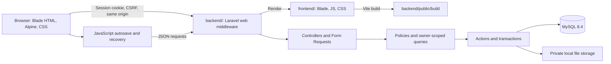

# Architecture, Environment, and File Responsibilities

## A01 — Same-origin frontend/backend workspace

Use a modular monolith with separate source roots. `frontend/` owns Blade,
Alpine, browser state modules, CSS, Vite and JavaScript tests. `backend/` owns
Laravel, HTTP/API behavior, authentication, MySQL, private files and PHPUnit
tests. Laravel renders the frontend Blade files and serves Vite's built output,
so browser and API traffic remain same-origin.



This gives the repository a reviewable frontend/backend boundary without adding
a second application server. Do not introduce microservices, a separate Node
backend, a frontend router, Redis, or duplicated authentication. Later
capabilities can extend the existing policies/actions without being prebuilt.

### Architecture decision: split source, preserve same origin

- Status: accepted on 2026-09-10.
- Decision: use `frontend/` and `backend/` as top-level source roots; keep Laravel
  responsible for Blade rendering and public asset delivery.
- Reason: the application already relies on Laravel sessions, CSRF, named routes
  and server-rendered bootstrap data. A standalone SPA would require a new auth,
  CORS and deployment contract without improving R1 behavior.
- Consequence: frontend and backend can be reviewed and tested independently,
  but they are deployed together. `frontend/vite.config.js` and
  `backend/config/view.php` are the explicit integration points.

## A02 — Runtime and packages

| Component | Selected baseline | Rule |
| --- | --- | --- |
| PHP | 8.5.x | Native Linux interpreter; CLI and server must load the same required extensions |
| Laravel | 13.x | Scaffold stable Laravel 13; retain framework-compatible stable dependencies |
| Composer | 2.x | Keep `composer.lock`; run `composer check-platform-reqs` |
| MySQL | 8.4.x, InnoDB | Real MySQL for application and database tests |
| Node/npm | Existing Node 22.22.2, npm 10.9.7 | Record in `.nvmrc`/README; Node is build/test tooling |
| Vite | 8.x | `laravel-vite-plugin` 3.x, compatible with the scaffold |
| Alpine | `alpinejs` 3.x | Bundle locally, register data components once before `Alpine.start()` |
| CSS/font | Custom CSS, `@fontsource/noto-sans` | Bundle font files locally; no runtime CDN requests |
| PHP tests | Scaffold-compatible PHPUnit 12.x | Laravel feature tests and focused unit tests |
| JS tests | Node built-in `node:test` | Test pure state modules with injected transport/clock/storage |
| Formatting | Laravel Pint, Prettier 3.x | Keep rules modest and deterministic |
| Browser review | Installed Playwright skill CLI | Browser scenarios and screenshots; no new E2E framework required |

Do not add TypeScript, React, Vue, Livewire, Inertia, Tailwind, Bootstrap, an auth starter kit, or Sanctum. Their extra conventions are unnecessary for this fixed plan. Remove the scaffold's Tailwind plugin/dependencies/imports and optional development-tool dependencies not used by the two-process workflow. Preserve necessary Vite/Laravel integration. Use built-in `fetch`, not Axios.

Resolve package patches during T00/T01, write lockfiles, and use `composer install`/`npm ci` thereafter. Do not use an unpinned CDN or repeatedly run dependency updates while implementing features.

## A03 — Observed environment and preparation

At planning time: Ubuntu 26.04 LTS, Node 22.22.2/npm 10.9.7, Git; no PHP, Composer, MySQL client/server, or application code. Local package metadata offers PHP 8.5, MySQL 8.4, and Composer 2.9.5. These observations are not evidence of installation.

T00 must recheck:

```bash
php --version
php -m
composer --version
mysql --version
node --version
npm --version
```

Native Ubuntu package route, if still missing and installation is authorized/available:

```bash
sudo apt update
sudo apt install php-cli php-mysql php-mbstring php-xml php-curl php-zip php-intl php-gd composer mysql-server unzip
```

Required extensions include PDO/pdo_mysql, mbstring, intl, fileinfo, openssl, session, tokenizer, ctype, DOM/XML, curl, zip, and GD with JPEG/PNG/WebP decoding. Verify installed versions, not just package exit status. If local privilege or service startup fails, report the actual issue; do not adopt Docker or another database to hide it.

Start MySQL using the host's available service manager (`systemctl` where supported; `service` otherwise). Create two databases: `notes_dev` and `notes_test`, both utf8mb4 with `utf8mb4_0900_ai_ci`. Create separate local SQL users with rights only on their corresponding database. Obtain/store generated passwords through local configuration without printing them in logs or committing them. The application must not connect as MySQL root.

Configure PHP for attachments: `upload_max_filesize = 20M`, `post_max_size = 25M`, `memory_limit = 256M`. Confirm the interpreter running `artisan serve` loads those values.

## A04 — Workspace layout

The root keeps the assignment and shared planning documents. Application source
is split into `frontend/` and `backend/`; neither directory is a separate Git
repository. Keep Composer and Artisan commands inside `backend/`, and npm/Vite
commands inside `frontend/`. Configure MySQL before migrations and never
regenerate the key of a populated installation as a routine start command.

Do not initialize, commit, or push Git merely to fabricate assignment contribution evidence. Prepare appropriate `.gitignore` content; normal repository operations remain subject to the user's implementation request.

## A05 — Local configuration

Document these in `.env.example` with safe placeholders:

```dotenv
APP_NAME="Ghi chu"
APP_ENV=local
APP_KEY=
APP_DEBUG=true
APP_URL=http://localhost:8000
APP_LOCALE=vi
APP_FALLBACK_LOCALE=en
APP_TIMEZONE=UTC
DB_CONNECTION=mysql
DB_HOST=127.0.0.1
DB_PORT=3306
DB_DATABASE=notes_dev
DB_USERNAME=notes_dev
DB_PASSWORD=
SESSION_DRIVER=database
SESSION_LIFETIME=120
SESSION_ENCRYPT=true
SESSION_SECURE_COOKIE=false
SESSION_SAME_SITE=lax
CACHE_STORE=file
QUEUE_CONNECTION=sync
FILESYSTEM_DISK=private
HASH_DRIVER=bcrypt
BCRYPT_ROUNDS=12
MAIL_MAILER=log
```

The example origin/port is replaceable configuration, not a hardcoded application URL. `MAIL_MAILER=log` is an inert safe default; R1 must not claim delivery or trigger activation notifications. Sessions use HttpOnly cookies and are host-only. Require Secure cookies when HTTPS is introduced later. Production debug output is a later deployment concern; do not expose local stack traces in JSON error responses.

`private` disk root: `storage/app/private`, serving disabled, exception-on-write-failure enabled. Never run `storage:link` to expose these files. Database-backed sessions need the standard Laravel `sessions` migration. File cache avoids a Redis requirement. No worker is required in R1.

The app uses `APP_URL` only for configuration-dependent server needs. Browser actions/assets use same-origin root-relative URLs or Blade-generated relative route paths. No embedded `localhost:8000` in JS/CSS/templates.

## A06 — Run and verification commands to establish

First installation after configuration, from the repository root:

```bash
cd backend
composer install
php artisan key:generate
php artisan migrate

cd ../frontend
npm ci
npm run build
```

The key-generation line is **first installation only**. Use separate terminals during development:

```bash
cd backend
php artisan serve --host=127.0.0.1 --port=8000
```

```bash
cd frontend
npm run dev
```

Define/document `npm run test:unit`, `npm run format:check`, `npm run build`, `php artisan test`, and `vendor/bin/pint --test`. Configure build/test scripts explicitly rather than implying the untouched scaffold already has them. A built app must also work with Vite's dev server stopped. Do not make the default start command spawn queues, log tails, or other optional services.

Create `.env.testing` locally with a separate test SQL user/database and application key; do not commit secrets. Test safety requirements are in document 08. Never use `migrate:fresh` against `notes_dev`. An optional `DemoSeeder` is not part of R1; initial user registration supplies real data, and factories supply test data.

## A07 — File map

Use these responsibilities; file splitting into smaller helpers is allowed without changing contracts.

```text
backend/app/
  Actions/Auth/{RegisterUser,ChangePassword}.php
  Actions/Notes/{CreateNote,UpdateNote,DeleteNote}.php
  Actions/Labels/{CreateLabel,RenameLabel,DeleteLabel}.php
  Actions/Files/{UploadAttachment,DeleteAttachment,ReplaceAvatar,RemoveAvatar}.php
  Actions/Files/ProcessFileDeletion.php
  Console/Commands/PrunePrivateFiles.php
  Http/Controllers/Auth/{RegisteredUserController,SessionController}.php
  Http/Controllers/{NotesPageController,SettingsPageController}.php
  Http/Controllers/Api/{SessionController,NoteController,LabelController}.php
  Http/Controllers/Api/{AttachmentController,ProfileController,PreferenceController,PasswordController}.php
  Http/Controllers/{AttachmentContentController,AvatarContentController}.php
  Http/Requests/   # One request class per mutating operation/query contract
  Http/Resources/{UserResource,PreferenceResource,NoteResource,NoteSummaryResource,LabelResource,AttachmentResource}.php
  Http/Middleware/PrivateResponseHeaders.php
  Models/{User,UserPreference,Note,Label,Attachment,PendingFileDeletion}.php
  Policies/{NotePolicy,LabelPolicy,AttachmentPolicy}.php
  Queries/NoteListQuery.php
  Support/{NoteSnapshot,TextNormalizer,ApiError}.php
  Rules/{BcryptPassword,ValidNoteText,AllowedAttachment,ValidAvatar}.php
backend/bootstrap/app.php
backend/config/{filesystems,hashing,session,view}.php
backend/database/{migrations,factories,seeders}/
backend/public/                  # Web document root and generated Vite assets
backend/routes/web.php
backend/storage/app/private/     # Never exposed through a public symlink
backend/tests/{Feature,Unit}/
frontend/src/
  views/layouts/{app,guest}.blade.php
  views/auth/{login,register}.blade.php
  views/notes/index.blade.php
  views/settings/{profile,preferences,password}.blade.php
  views/components/{icon,dialog,form-error,save-status}.blade.php
  views/notes/partials/{sidebar,toolbar,note-grid,note-list,editor,labels-dialog,attachments}.blade.php
  js/app.js
  js/lib/{http,normalization,recovery-store,clock}.js
  js/notes/{autosave-machine,notes-page,note-editor,attachment-uploader,label-manager}.js
  js/settings/{profile,preferences,password}.js
  css/{app,tokens,base,layout,components,notes,settings}.css
frontend/tests/js/{autosave-machine,recovery-store,notes-query}.test.js
frontend/vite.config.js          # Emits into backend/public/build
docs/{plan,implementation-status.md,verification.md}
output/playwright/    # Ignored browser evidence
Readme.txt
```

Keep algorithms in plain JS modules, not long inline Alpine attribute expressions. Blade partials provide layout; Alpine components bind to state; actions enforce business operations; Form Requests validate shape; policies enforce identity; queries build scoped reads. No DB calls in Blade or file operations inside view code.

## A08 — HTTP and security boundaries

- Define HTML and `/api/v1/*` routes in `routes/web.php`; apply Laravel's web session/CSRF middleware. No separate stateless API stack. Protect authenticated routes with `auth` and `auth.session`.
- Keep Laravel 13's default `PreventRequestForgery` behavior: valid same-origin fetch metadata is accepted, otherwise token validation applies. Always send the token from this app, but do not incorrectly expect a same-origin browser request without it to fail. Verify rejected CSRF requests without a valid origin signal and without a valid token. Do not enable origin-only mode, broaden same-site acceptance, or exclude application mutation routes. See the [Laravel 13 CSRF contract](https://laravel.com/docs/13.x/csrf).
- Use policy checks and owner-scoped queries on every resource access, including nested attachments. Foreign and nonexistent resource IDs return the same 404.
- Disable framework whitespace trimming/empty-string conversion for JSON note routes, then explicitly normalize only the intended fields. Preserve body indentation/newlines. Password fields bypass trimming too.
- Use Laravel auth/hash/session primitives. Configure bcrypt explicitly. Change-password behavior is logout of all sessions, including this one; no custom authentication implementation.
- Private HTML/JSON/file responses: `Cache-Control: private, no-store`, `X-Content-Type-Options: nosniff`, `Referrer-Policy: same-origin`; HTML also denies framing. Static Vite assets may be cached normally.
- Server-rendered user data uses Blade escaping or `Js::from`; dynamic note data uses text bindings. A strict CSP is not required for R1's Alpine build; do not claim one is active without verifying compatibility.
- Log operation identifiers and generic errors, not passwords, note bodies, uploaded bytes, request bodies, or cookies.

## Primary implementation references

- [Laravel installation](https://laravel.com/docs/13.x/installation) and [Vite integration](https://laravel.com/docs/13.x/vite): framework/build setup.
- [Laravel authentication](https://laravel.com/docs/13.x/authentication) and [hashing](https://laravel.com/docs/13.x/hashing): session/hash primitives.
- [Request normalization](https://laravel.com/docs/13.x/requests#input-trimming-and-normalization): middleware behavior to adapt for note bodies.
- [Alpine installation](https://alpinejs.dev/essentials/installation): bundled component initialization.
- [Vite's Node compatibility](https://vite.dev/guide/): the observed Node 22.22.2 meets its Node 22.12+ requirement.
- [PHP bcrypt behavior](https://www.php.net/manual/en/function.password-hash.php): 72-byte limit; the project's explicit validation prevents truncation.

These references substantiate framework behavior. Business limits, chosen architecture, and module names above are project decisions.
