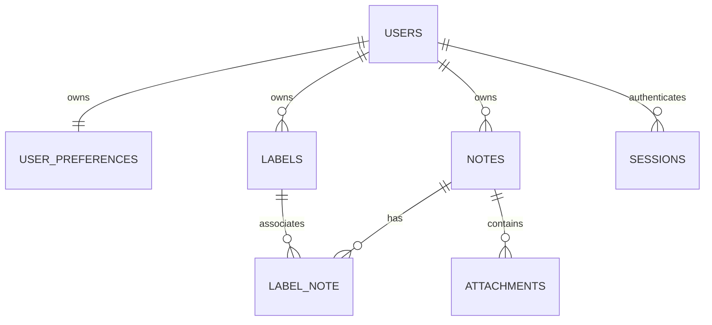

# Database Schema and Mutation Invariants

## Shared conventions

- MySQL 8.4, InnoDB, database charset `utf8mb4`, default collation `utf8mb4_0900_ai_ci`.
- Foreign-key column definitions must exactly match their referenced types/collations.
- User/label IDs: unsigned BIGINT auto-increment. Public JSON serializes all IDs as strings to avoid JavaScript integer precision issues.
- Note/attachment IDs: lowercase UUID v4 in `CHAR(36)` with ASCII binary collation. Generate in the browser with `crypto.randomUUID()` and validate on the server. These are system-managed idempotency keys, not user-entered fields.
- Time: UTC `DATETIME(6)` for application timestamps; serialize ISO 8601 with microseconds and `Z`. Configure Eloquent date serialization/storage consistently.
- `version`: unsigned integer starting at 1. Clients cannot choose the next value.
- Use migrations as executable schema. The tables below are the design contract, not a second hand-maintained SQL schema.

## Tables

### `users`

| Column | Type/default | Constraint/meaning |
| --- | --- | --- |
| id | BIGINT unsigned | Primary key |
| email | VARCHAR(254), ASCII case-insensitive | Unique; normalized lowercase |
| display_name | VARCHAR(80) | Required |
| password | VARCHAR(255) | bcrypt hash; hidden from serialization |
| email_verified_at | DATETIME(6), null | Reserved for later verification; normal R1 users remain unverified |
| avatar_path | VARCHAR(255), null | Relative path on private disk; never exposed as raw path |
| remember_token | VARCHAR(100), null | Laravel compatibility; Remember me login disabled |
| created_at, updated_at | DATETIME(6) | Server-managed |

Use `display_name` consistently, including auth registration mapping and default avatar. Do not accidentally keep a separate unused `name` field from the scaffold.

### `user_preferences`

| Column | Type/default | Constraint |
| --- | --- | --- |
| user_id | BIGINT unsigned | Primary key and FK to users; cascade on delete |
| theme | VARCHAR(8), `light` | `light`, `dark` |
| note_font_size | TINYINT unsigned, 16 | 14, 16, 18 |
| default_note_color | VARCHAR(16), `neutral` | neutral, lemon, mint, sky, rose |
| notes_view | VARCHAR(8), `grid` | grid, list |
| created_at, updated_at | DATETIME(6) | Server-managed |

Create the preferences row in the registration transaction. Model/factory defaults must agree with API/UI defaults. Use DB CHECK constraints for these finite values in addition to request validation.

### `notes`

| Column | Type/default | Constraint/meaning |
| --- | --- | --- |
| id | CHAR(36) ASCII binary | Primary key, client-generated UUID |
| user_id | BIGINT unsigned | FK users, cascade on delete |
| title | VARCHAR(200) | Nonempty for active notes; empty only in scrubbed tombstones |
| content | MEDIUMTEXT | Valid plain text for active notes; empty only in tombstones |
| color | VARCHAR(16), `neutral` | Same allowed tokens as default color |
| pinned_at | DATETIME(6), null | Null = unpinned |
| version | INT unsigned, 1 | >= 1; increment according to rules below |
| deleted_at | DATETIME(6), null | Internal scrubbed tombstone; never a trash/restore feature |
| created_at, updated_at | DATETIME(6) | Server-managed |

Indexes:

- Primary `id`.
- `(user_id, deleted_at, pinned_at, updated_at, id)` for owner/active/order access.
- `(user_id, deleted_at, updated_at, id)` for ordinary notes.

Do not add a full-text dependency for R1. Literal substring searching may scan the owner's rows; it is acceptable for the defined personal workload and must be measured in T12. Do not claim these indexes accelerate a leading-wildcard content search.

Default model queries exclude deleted rows. `withTrashed()` is restricted to create-replay and deletion paths that enforce ownership; no read/update/attachment route exposes a tombstone.

### `labels`

| Column | Type/default | Constraint |
| --- | --- | --- |
| id | BIGINT unsigned | Primary key |
| user_id | BIGINT unsigned | FK users, cascade on delete |
| name | VARCHAR(40), `utf8mb4_0900_as_ci` | Accent-sensitive, case-insensitive |
| version | INT unsigned, 1 | >= 1; changes on a real rename |
| created_at, updated_at | DATETIME(6) | Server-managed |

Unique `(user_id, name)`; index `(user_id, name, id)`. Do not rely only on pre-insert uniqueness validation: map a duplicate-key race to a 422 field error.

### `label_note`

| Column | Type | Constraint |
| --- | --- | --- |
| note_id | CHAR(36) ASCII binary | FK notes; cascade on physical deletion |
| label_id | BIGINT unsigned | FK labels; cascade on deletion |

Composite primary `(note_id, label_id)` and index `(label_id, note_id)`. No pivot timestamps. Enforce matching owners in application transactions; this join alone does not establish authorization. Never `sync()` unvalidated client label IDs.

### `attachments`

| Column | Type/default | Constraint/meaning |
| --- | --- | --- |
| id | CHAR(36) ASCII binary | Primary key, client upload UUID |
| note_id | CHAR(36) ASCII binary | FK notes, cascade on physical deletion |
| original_name | VARCHAR(255) | Display-only sanitized basename; blank in tombstone |
| path | VARCHAR(255), null | Private randomized path; null only after deletion |
| mime_type | VARCHAR(127) | Server-detected type; blank in tombstone |
| kind | VARCHAR(8) | image, video, file |
| size_bytes | BIGINT unsigned | Actual stored size; zero in tombstone |
| sha256 | CHAR(64) ASCII binary, null | Actual file digest, used for replay consistency |
| deleted_at | DATETIME(6), null | Internal removal tombstone |
| created_at, updated_at | DATETIME(6) | Server-managed |

Index `(note_id, deleted_at, created_at, id)`; unique non-null `path`. Ownership derives from the note, not a client-supplied `user_id`. Active attachment quota queries always use `deleted_at IS NULL`.

Attachment tombstones retain only identity, note relationship, deletion time, and minimal fixed values. Retrying a removed upload UUID returns 410 for its owner, never re-uploads it.

### `pending_file_deletions`

| Column | Type/default | Constraint |
| --- | --- | --- |
| id | BIGINT unsigned | Primary key |
| path | VARCHAR(255) | Unique relative path, private disk only |
| attempts | INT unsigned, 0 | Cleanup retry count |
| created_at, updated_at | DATETIME(6) | Server-managed |

This small technical table makes database deletion and filesystem cleanup recoverable. Do not introduce a queue service for it. A missing file counts as successful cleanup; successful cleanup deletes the row.

### Laravel infrastructure

Use the standard `sessions` table (`id`, nullable/indexed `user_id`, IP, user agent, payload, indexed last activity) required by the selected session driver. Preserve Laravel's `migrations` table. R1 needs no jobs/cache/password-reset-token tables; create future feature tables in their own later migrations, or remove unused scaffold migrations before the first migration.

## Relationships

## Transaction and ownership rule

For **all note, label, and attachment mutations**, start a short DB transaction and lock the authenticated user's `users` row with `SELECT ... FOR UPDATE`. Then re-query the target with owner scope and acquire any needed note/label locks. This serializes writes by one owner and prevents label deletion, quotas, and note deletion from racing within R1. Reads do not acquire the owner lock.

Always lock in order: user → notes sorted by ID → labels sorted by ID → attachments. Never hold DB locks during file validation, hashing, image decoding, external calls, or large file copying. The modest per-owner write serialization is intentional for R1; sharing requires redesigning the aggregate lock as described in document 09.

Use database transactions and actual row locking, not a check performed outside the write transaction. Laravel's [locking API](https://laravel.com/docs/13.x/queries#pessimistic-locking) maps to database locks; MySQL describes their [transactional behavior](https://dev.mysql.com/doc/refman/8.4/en/innodb-locking-reads.html).

## Canonical editable snapshot

`{ title, content, color, is_pinned, label_ids }` is the complete editable snapshot. Normalize text, convert IDs to canonical decimal strings, deduplicate/sort label IDs numerically, and convert pin to a boolean. Validate limits. Compare these values, not JSON key order or timestamps.

`pinned_at`, note ID, owner, version, attachments, and timestamps are never client-editable snapshot fields.

## Create algorithm

1. Validate shape and text outside the transaction; normalize title/body/color.
2. Lock the owner row. Search the requested UUID including tombstones.
3. An existing UUID owned by someone else yields generic 404 without contents.
4. An owned tombstone yields 410 `NOTE_DELETED`.
5. An existing owned active note whose editable snapshot matches the original create defaults (submitted title/body/color, unpinned, no labels) yields 200 with the current note and `replayed: true`; do not update any fields.
6. A different active snapshot for the same owned UUID yields 409 `CREATE_CONFLICT` with the current note. It must not overwrite an already-created/edited note.
7. Otherwise insert version 1, unpinned, no labels, current timestamps. Return 201.

The UUID remains the same across network retries. New UUIDs are generated only for a genuinely new draft, never just because a response was lost.

## Update algorithm

1. Normalize/validate snapshot shape; lock owner and re-read the active owned note and its current label IDs.
2. If canonical desired snapshot equals current snapshot, return 200 unchanged even when `base_version` is older. This acknowledges a lost successful response without incrementing the version.
3. Otherwise, if `base_version != current.version`, return 409 `NOTE_CONFLICT` with current detail; change nothing.
4. Verify each desired label exists and belongs to the owner. Reject invalid labels with 422 and `errors.label_ids`; do not leak other owners' label names.
5. Update title/content/color and pin state; false→true sets server time, true→true retains pin time, false clears it. Sync validated label IDs. Increment version exactly once and update `updated_at` once in this transaction.
6. Return canonical note detail after the transaction. A retry that now matches step 2 is a no-op.

Syntax validation must not reject stale/deleted label references before the version conflict check. Cross-owner validation still happens before any write. This order allows the client to recover an outdated snapshot after a concurrent label deletion.

## Delete algorithm

1. User confirms in the UI; submit note ID and `base_version`.
2. Lock owner; an unknown/foreign ID returns 404. An owned tombstone returns 204 (idempotent retry).
3. If version differs, return 409 with current detail. Require a fresh explicit deletion confirmation; never automatically retry deletion using the new version.
4. For each active attachment, insert its path into `pending_file_deletions`, scrub it and mark deleted.
5. Detach labels. Set title/content to empty, color neutral, pin null, `deleted_at = now`, increment version/update time. Retain the UUID to reject late create/update requests.
6. Commit; attempt physical cleanup after commit. Return 204 once metadata is inaccessible. If disk deletion fails, leave cleanup rows for retry and log only identifiers.

Never expose a restore endpoint or retain deleted note contents in the tombstone. Database backups are an operational consideration, not a product trash feature.

## Label operations

- Create under the owner lock; enforce 100-label quota/uniqueness; version 1.
- Rename requires `base_version`; normalized exact no-op returns current data, stale different name returns 409 `LABEL_CONFLICT`. Actual rename increments label version, not note versions: note snapshots contain IDs, and resource serialization joins current names.
- Delete requires `base_version`; stale version returns conflict. Remove pivots and increment each affected active note's version/update time once because its editable label set changed. Delete the label row. Unknown/already-deleted labels return 404; the UI can treat a known deletion retry's 404 as already removed.
- Operations must never delete notes or attachments merely because a label was deleted.

## Files and cleanup

1. Validate uploaded bytes/type/limits, compute SHA-256, then store under a fresh random path below `attachments/` or `avatars/` on the private disk. Never use the original filename as a path.
2. In a short transaction, lock owner/recheck note state and quotas, then persist the path. Replay of an active upload ID is 200 only if note, digest, and sanitized original filename match; otherwise 409 `UPLOAD_ID_REUSED`. Owned removed ID is 410.
3. On validation/quota/DB failure, delete any newly stored unreferenced path. A process crash may leave an orphan; the prune command handles it.
4. On removal or avatar replacement, enqueue old paths in `pending_file_deletions` in the same transaction as the metadata change. Cleanup outside the transaction. Avatar replacement must not remove the old file before the replacement is successfully persisted.
5. `php artisan files:prune`: process pending deletions; also inspect only managed attachment/avatar directories for files older than one hour that are not referenced by any active attachment or user avatar. Never inspect/delete arbitrary disk paths. Skip recently written files to avoid racing uploads.
6. Cleanup must be repeatable and handle files already absent. Reject paths escaping the private root; do not follow symlinks outside it.

R1 runs cleanup after removals/replacements and documents the command for startup/maintenance. A scheduler or queue worker is not a prerequisite. Do not claim bytes are physically gone when a cleanup failure remains.

## Read invariants

- Every note list is scoped to authenticated owner and active notes before search/filter conditions; group title/body OR conditions so they cannot escape owner scope.
- Preload labels/counts in batches; no query-per-card behavior. Detail additionally returns active attachment metadata.
- File serving rechecks active attachment, active parent note, and owner before opening a disk path. Deleted or missing files return 404, never a storage path.
- Labels are distinct in filtered results: use `whereHas`/EXISTS or distinct note IDs, not a join that duplicates one note for two selected labels.
