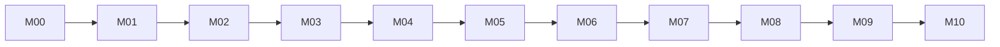

# Implementation Phase Index

Statuses: Pending, Ready, In Progress, Blocked, Verified, Skipped. Skipped requires implementation plus evidence equivalent to the task gate.

| Phase | Specification | Current status | Depends on |
| --- | --- | --- | --- |
| M00 | [Baseline](phases/M00-baseline.md) | Verified | none |
| M01 | [Foundation](phases/M01-foundation.md) | Verified | M00 |
| M02 | [HTTP and Auth](phases/M02-http-auth.md) | Verified | M01 |
| M03 | [Notes and Tags](phases/M03-notes-tags.md) | Verified | M02 |
| M04 | [Private Files](phases/M04-files.md) | Verified | M03 |
| M05 | [Cutover](phases/M05-cutover.md) | Verified | M04 |
| M06 | [Planning Core](phases/M06-planning.md) | Verified | M05 |
| M07 | [Habits and Recurrence](phases/M07-habits-recurrence.md) | Verified | M06 |
| M08 | [Dashboard and Reviews](phases/M08-dashboard-reviews.md) | Verified | M07 |
| M09 | [AI](phases/M09-ai.md) | Verified | M08 |
| M10 | [Acceptance](phases/M10-acceptance.md) | Verified | M09 |

## Dependency graph

Original migration and R1 baseline records belong in Git history. Current evidence and its limits are maintained in `docs/verification.md`; a historical Verified phase does not certify every later change or unresolved audit finding.

## Task execution record

For each task, append to `docs/implementation-status.md`: task ID/status, files changed, exact commands, result counts, browser/manual evidence, and remaining limitations. A document-only or UI-only change never proves backend behavior.
